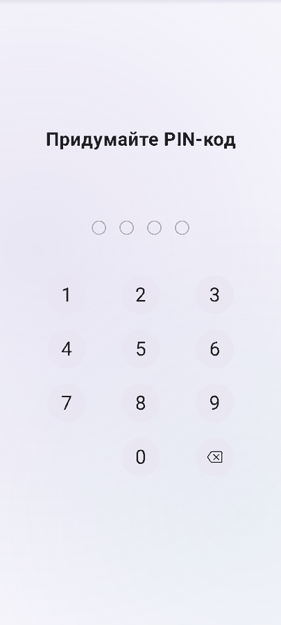

# PIN Authentication Library on Jetpack Compose

[](https://jitpack.io/#Khokhlinvladimir/android-pin-authentication)

[Версия на английском языке](https://github.com/Khokhlinvladimir/android-pin-authentication/blob/main/README.md)

## Описание

Библиотека для аутентификации пользователей с использованием PIN-кода. Эта библиотека предоставляет удобные и безопасные способы проверки личности пользователей с помощью простого числового PIN-кода. Она может быть использована разработчиками при создании приложений, требующих дополнительного слоя безопасности или идентификации пользователей.

## Анимации и сценарии

<table>
  <tr>
    <td align="center"><strong>Создание и подтверждение</strong><br></td>
    <td align="center"><strong>Быстрая проверка</strong><br></td>
  </tr>
  <tr>
    <td align="center"><strong>Ошибка и восстановление</strong><br></td>
    <td align="center"><strong>Подтверждение сброса</strong><br></td>
  </tr>
</table>

## Основные возможности

1. Простая и интуитивно понятная аутентификация с помощью PIN-кода.
2. Надежное хранение и защита PIN-кодов пользователей при помощи кодирования.
3. Возможность настройки требуемой длины и сложности PIN-кода.
4. Ограничение количества попыток ввода PIN-кода для предотвращения атак брутфорса.
5. Расширенные опции настройки и уведомлений о событиях. 

# Инструкция по использованию библиотеки для аутентификации по PIN-коду

Эта инструкция поможет вам ознакомиться с использованием библиотеки для аутентификации по PIN-коду в вашем приложении. Библиотека предоставляет простой и надежный способ защиты доступа к вашему приложению с помощью PIN-кода. Давайте разберемся, как это работает:

## Шаг 1: Установка библиотеки

Установка библиотеки для аутентификации по PIN-коду — первый шаг к безопасной защите вашего приложения.

1. Внесите зависимость в файл build.gradle:

```gradle
dependencies {
   implementation 'com.github.Khokhlinvladimir:android-pin-authentication:v2.0.0-alpha02'
}
```
С этим простым шагом, вы включите мощный инструмент аутентификации в вашем приложении, делая его надежным и безопасным.

2. Указание репозитория в файле settings.gradle:

```gradle
dependencyResolutionManagement {
    repositoriesMode.set(RepositoriesMode.FAIL_ON_PROJECT_REPOS)
    repositories {
        mavenCentral()
        maven { url 'https://jitpack.io' }
    }
}
```
Не забудьте добавить эту настройку в ваш файл settings.gradle, чтобы убедиться, что библиотека будет доступна для загрузки.
## Шаг 2: Инициализация библиотеки

В вашей активности или фрагменте инициализируйте библиотеку следующим образом:

```kotlin
val pinCodeStateManager = PinCodeStateManager.getInstance()
```

## Шаг 3: Настройка параметров безопасности

Установите параметры безопасности, такие как максимальное количество попыток ввода PIN-кода, длина PIN-кода и активация биометрической аутентификации:

```kotlin
pinCodeStateManager.setMaxPinAttempts(maxAttempts = 4, application = application)
pinCodeStateManager.setPinLength(pinLength = 4, application = application)
pinCodeStateManager.setBiometricEnabled(enabled = true, application = application)
pinCodeStateManager.autoLaunchBiometricEnabled(enabled = true,application = application)
```

## Шаг 4: Создание, валидация, изменение и удаление PIN-кода

Библиотека поддерживает четыре основных сценария:

### 1. Создание PIN-кода

```kotlin
pinCodeStateManager.setScenario(PinCodeScenario.CREATION)
```

Позволяет пользователю создать новый PIN-код.

### 2. Валидация PIN-кода

```kotlin
pinCodeStateManager.setScenario(PinCodeScenario.VALIDATION)
```

Пользователь может войти в приложение, введя свой существующий PIN-код. Библиотека проверит введенный PIN-код на соответствие и, при успешной валидации, предоставит доступ к приложению.

### 3. Изменение PIN-кода

```kotlin
pinCodeStateManager.setScenario(PinCodeScenario.CHANGE)
```

Позволяет пользователю изменить свой текущий PIN-код на новый.

### 4. Удаление PIN-кода

```kotlin
pinCodeStateManager.setScenario(PinCodeScenario.DELETION)
```

Пользователь может удалить свой текущий PIN-код.

## Шаг 5: Обработка событий

Обработайте события, такие как успешное создание, валидация, изменение и удаление PIN-кода, а также исчерпание попыток ввода:

```kotlin
pinCodeStateManager.onCreationSuccess {
    // Обработка успешной установки PIN-кода
}

pinCodeStateManager.onValidationSuccess {
    // Обработка успешной валидации PIN-кода
}

pinCodeStateManager.onLoginAttemptsExpended {
    // Обработка исчерпания попыток ввода PIN-кода
}

// и так далее для других событий
```

## Шаг 6: Интеграция с интерфейсом приложения

Интегрируйте библиотеку с интерфейсом вашего приложения

```kotlin
Surface(
    modifier = Modifier.fillMaxSize(),
    color = MaterialTheme.colorScheme.background
) {
    // Вывести экран для ввода или валидации PIN-кода
    PinCodeScreen()
}
```

Это основные шаги по использованию библиотеки для аутентификации по PIN-коду в вашем Android-приложении. Настраивайте библиотеку и обрабатывайте события в соответствии с вашими потребностями для создания безопасного и удобного опыта для пользователей.

## Экспериментальный API контроллера (2.0.0-alpha02)

Новый API работает через неизменяемый `StateFlow`, не зависит от глобального `PinCodeStateManager` и поддерживает настраиваемую motion-систему.

```kotlin
PinAuthScreen(
    controller = controller,
    scenario = PinAuthScenario.VALIDATION,
    motionSpec = PinAuthMotionSpec.Premium,
    onResult = { result ->
        if (result == PinAuthResult.Validated) openProtectedContent()
    }
)
```

`PinAuthMotionSpec.Premium` включает пружинный ввод PIN, анимацию удаления, shake при ошибке, пульсацию во время проверки, success-состояние, анимации клавиатуры, haptic feedback и фоновое свечение. Для полностью статичного интерфейса используйте `PinAuthMotionSpec.None`.

При включённой биометрии и зарегистрированном отпечатке controller API показывает кнопку биометрической проверки в сценарии валидации. Сброс через «Забыли PIN-код?» отправляется приложению только после подтверждения диалога.

## Безопасность и миграция

- Новые PIN хранятся как HMAC-verifier, защищённый неизвлекаемым ключом Android Keystore. Записи PBKDF2 и старые записи SHA-256 автоматически мигрируют после первой успешной проверки.
- Проверка и сохранение PIN выполняются вне UI-потока Compose.
- После исчерпания лимита попыток ввод остаётся заблокированным между перезапусками процесса. Приложение должно предоставить восстановление через `onResetPassword` и `clearConfiguration`.
- Допустимая длина PIN — от 4 до 12 цифр, число попыток — от 1 до 100.
- Локальный PIN является блокировкой приложения, а не заменой серверной аутентификации. PIN-настройки следует исключать из резервных копий.

## Технические спецификации:

Минимальная версия SDK (minSdk): 24

Целевая версия SDK (targetSdk): 34

Версия Gradle: 8.5.2

Версия OpenJDK: 17.0.1

## Лицензия

Эта библиотека распространяется под лицензией MIT. Подробности можно найти в файле LICENSE.

## Автор

Библиотека разработана и поддерживается Khokhlin Vladimir. Вы можете связаться со мной через telegram [@vkhokhlin](https://t.me/vkhokhlin).

## Содействие

Если у вас есть предложения по улучшению библиотеки или вы обнаружили ошибку, пожалуйста, создайте issue или отправьте пулл-реквест в репозиторий на GitHub.
